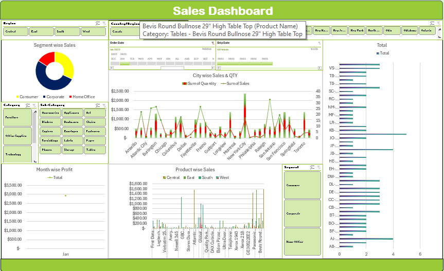

# 📊 Sales Dashboard

An interactive **Excel Sales Dashboard** project created to analyze sales performance, profit trends, customer behavior, and regional insights using Excel analytics tools.
## 📑 Table of Contents
- [Project Overview](#-project-overview)
- [Tools & Skills Used](#-tools--skills-used)
- [Key Insights](#-key-insights)
- [Project Structure](#-project-structure)
- [Dashboard Preview](#-dashboard-preview)
- [How to Use](#-how-to-use)
- [Business Value](#-business-value)
- [About Me](#-about-me)

---

## 🚀 Project Overview
This project demonstrates my **Data Analytics skills** by transforming raw sales data into meaningful insights. The dashboard helps stakeholders quickly understand business performance and make data-driven decisions.

**Objectives:**
- Analyze total sales, profit, and units sold
- Identify top-performing countries and markets
- Track customer and regional performance
- Visualize monthly and yearly trends

---

## 🛠 Tools & Skills Used
- Microsoft Excel  
- Pivot Tables & Pivot Charts  
-  Data Cleaning 
- Excel Formulas (SUMIFS, IF, VLOOKUP/XLOOKUP)  
- Slicers & Timelines  
- Data Visualization & Dashboarding  

---

## 📈 Key Insights
- Total Sales, Profit & Customers overview  
- Country-wise & Market-wise sales analysis  
- Top customers & regions  
- Monthly and yearly sales trends  
- Market share comparison  

---
## 📂 Project Structure
Excel-Sales-Dashboard/
│
├── Excel_Sales_Dashboard.xlsx
├── README.md
├── assets/
│ └── dashboard-preview.png

---

## 🖼 Dashboard Preview

---

## 📌 How to Use
1. Download or clone the repository  
2. Open 📥 [Download Excel Dashboard](Excel_Sales_Dashboard.xlsx)
 
3. Use slicers to filter by country, market, or year  
4. Analyze KPIs and charts for insights  

---

## 🎯 Business Value
- Quick performance tracking for management  
- Helps identify profitable markets  
- Supports strategic decision-making  

---

## 👨‍💻 About Me
**Abhishek Kumar**  
Aspiring **Data Analyst** skilled in Excel, SQL, Power BI, and data visualization. Passionate about converting data into actionable insights.

🔗 GitHub: https://github.com/abhishekdud430  
🔗 LinkedIn: (https://www.linkedin.com/in/abhishekkumar430)

<a href="#-table-of-contents">⬆ Back to Top</a>

---

 If you like this project, give it a star ⭐

